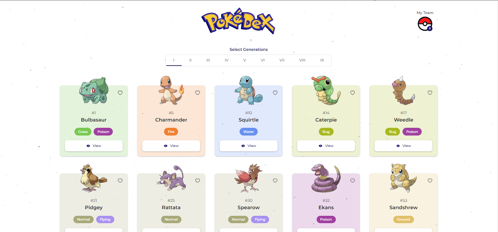

# Pokemon App

This project is created using [PokeAPI](https://pokeapi.co/).

Website URL: (https://pokemon-six-eta.vercel.app/)

**Prerequisites:**

**List the prerequisites required to run the project, such as:**

NodeJS: v14.17.3 (currently using)

Package Manager: Yarn (v1.22.19) / npm

**Dependencies**

React (v.18)

Node (Package Manager)

Typescript (latest)

Redux

Sass

Tailwind Css

If you are using npm

### `npm install`

If you are using Yarn

### `yarn install or yarn`

## Available Scripts

**Start development server on port 3000.**
If you are using npm

### `npm start`

If you are using Yarn

### `yarn start`

##

**Build for production:**

If you are using npm

### `npm run build`

If you are using Yarn

### `yarn build`

##

**Test for production:**

If you are using npm

### `npm run test`

If you are using npm

### `yarn test`

Watching Tests

### `npm run test –watch`
